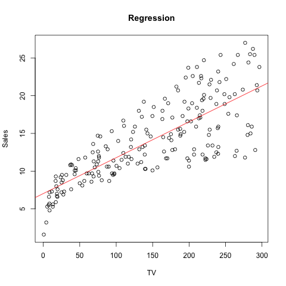

\section{Abstract}

In this report we reproduce the main results displayed in section 3.1 \text{Simple Linear Regression} (chapter 3) of the book *An Introduction to Statistical Learning*.

\section{Introduction}

The overall goal is to provide advice on how to improve sales of the particular product. More specifically, the idea is to determine whether there is an association between advertising and sales, and if so, develop an accurate model that can be used to predict sales on the basis of the three media budgets.
```{r, echo=FALSE, message=FALSE}
setwd("~/Desktop/Fall_2016/Stat159/stat159-fall2016-hw02")
library(xtable)
options(xtable.comment = FALSE)
```

\section{Data}

The Advertising data set consists of the *Sales* (in thousands of units) of a particular product in 200 different markets, along with advertising budgets (in thousands of dollars) for the product in each of those markets for three different media: *TV*, *Radio* and *Newspaper*. In this report we focus on the possible relation between *TV* and *Sales*. Following is the table for summary statistics for both *TV* and *Sales*:

```{r,echo=FALSE, results='asis'}
load('../data/eda-output.txt')
xtable(bothSummary, caption = 'Summary Statistics')
```

From the table above, the relation between the two variables are not very clear yet. We then explore with the following methodology.

\section{Methodology}

We consider one media from the data set, *TV*, and study its relationship with *Sales*. For this purpose, we use a simple linear model:

$$Sales = \beta_{0} + \beta_{1}TV$$

To estimate the coefficients $\beta_{0}$ and $\beta_{1}$ we fit a regression model via the least squares criterion.

The null hypothesis here is that the *TV* would not have an effect on *Sales*, and the alternative hypothesis is that *TV* does have an effect on *Sales*.


\section{Results}

After fitting the data to a simple linear regression model, we compute the regression coefficients:

```{r,echo=FALSE, results='asis', warning=FALSE}
load('../data/regression.rData')
modelInfo = summary(fit)
xtable(modelInfo$coefficients, caption = "Information about Regression Coefficients")
```

From the table above we can extract the intercept and slope for future graphing. And we see that the p values for both intercept and TV returned by this simple linear regression model are both smaller than 0.05, giving us enough evidence for the alternative hypothesis that these two factors do make a difference.

More information about the least squares model is given in the table below:

```{r, echo=FALSE, results='asis', warning=FALSE}
table2 = matrix(nrow =3, ncol= 2)
Quantity = c('RSS', 'R2', 'F-stat')
Value = c(modelInfo$sigma, modelInfo$r.squared, modelInfo$fstatistic[1])
table2[,1] = Quantity
table2[,2] = Value
colnames(table2) = c('Quantity', 'Value')
xtable(table2, caption = "Regression Quality Indices")
```

We can see that the Residual Sum of Squares and r squared for this model is relatively small, meaning that the simple linear regression model is a relatively good fit of the data.

And we plot the scattor plot with the fitted regression line.



As we can see from the scattor plot above, the regression line approxiates most the the relation between *TV* and *Sales*.


\section{Conclusions}

From the analysis above, we may see that *TV* does have an effect on *Sales*, and the simple linear regression does a relatively good job in capturing such relation.

Thinking ahead, we may consider incorporating other factors in the model to have a even better approximation on how it will go, with the hope that we can make more accurate predictions and thus decisions.

